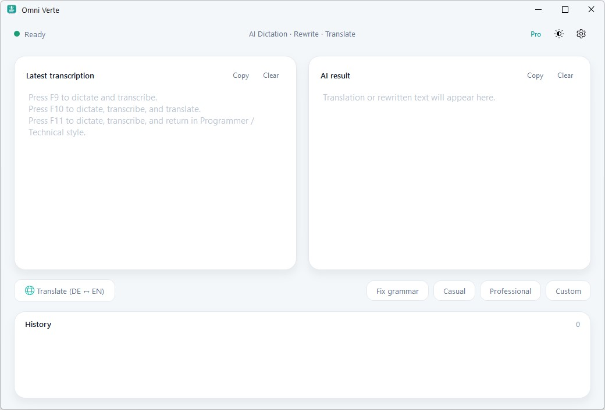

# Omni Verte

A Windows desktop voice assistant. Press a hotkey, speak, and your words are
transcribed and pasted into whatever window you were working in — optionally
grammar-corrected, translated, or rewritten by an LLM along the way.

It lives in the system tray, transcribes locally (faster-whisper) or via the
cloud (OpenAI / Groq), and has a small Qt/Fluent main window for reviewing and
re-processing what you dictated.

> **Platform:** Windows 10/11 only. It leans on Win32 APIs (global keyboard
> hooks, foreground-window focus, taskbar overlay, Credential Manager, mica
> backdrop). It will not run as-is on macOS/Linux.

---

<p align="center">
  
</p>

---

## Features

- **Hotkey dictation with per-action keys.** Three independent global hotkeys,
  each captures speech and then applies a different transform:
  - `F9` — **Transcribe**: grammar-correct and normalize to your primary language.
  - `F10` — **Transcribe + Translate**: force-translate into your secondary language.
  - `F11` — **Transcribe + Custom style**: rewrite using your own saved prompt.

  The transform is decided by the key that **stops** the take, not the one
  that starts it — so you can begin dictating with `F9`, decide mid-sentence
  you'd rather have the result in your secondary language, and just press
  `F10` to finish.

  Keys are rebindable. By default they are *hard-captured* (swallowed so the
  focused app never sees the keypress); this can be switched to pass-through.
  A **mouse-button** activation mode is also available.

- **Three transcription backends.** Configure a priority order (default
  **OpenAI → Groq → Local**); the first one with valid credentials becomes
  active at launch — so with no API keys the app runs fully offline on Local,
  and the moment you add an OpenAI (then Groq) key that cloud backend takes over:
  - **Local** — [faster-whisper](https://github.com/SYSTRAN/faster-whisper) on
    CPU or CUDA (`tiny` … `large-v3`). Fully offline.
  - **OpenAI** — `gpt-4o-mini-transcribe`, `gpt-4o-transcribe`, `whisper-1`.
  - **Groq** — `whisper-large-v3-turbo`, `whisper-large-v3`, `distil-whisper-large-v3-en`.

  Cloud backends have a per-request timeout and **sticky failover**: if the
  active cloud provider stalls, it transparently switches to the other one for
  the rest of the session.

- **AI text operations** (via OpenAI `gpt-4o-mini`), from the main window:
  - **Translate** — auto-detects direction between your two configured languages
    (a one-click **Swap** on the Languages settings page flips the pair).
  - **Fix grammar**, **Casual**, **Professional**, and a **Custom** rewrite style.

  Each call has a per-attempt wall-clock watchdog with retries on top of the
  SDK timeout — a hung socket can't freeze the UI; the abandoned call is
  dropped and the next attempt fires immediately. The deadline scales with the
  input length, so a long passage that legitimately takes many seconds isn't
  mistaken for a hang.

- **Main window** (Qt + Fluent, light/dark theme): side-by-side *Latest
  transcription* and *AI result* cards, a translate pill, the rewrite buttons,
  and a session **Activity Feed** (in-memory history of the session).

- **Multilingual UI.** The whole interface — main window, settings, onboarding,
  *and* the (non-Qt) tray menu — is translated into all **8 supported
  languages**: English, Русский, Español, Français, Deutsch, Italiano, 简体中文,
  and 日本語. Switch it live from **Settings → General** with no restart; by
  default it follows your Windows display language. (This is independent of your
  *transcription* language pair — you can run a Russian UI while dictating in
  English.)

- **Status everywhere** — a tray icon dot and a Windows taskbar overlay reflect
  *idle / recording / processing*, and a floating on-screen **pill** shows a live
  equalizer of your microphone level while recording. If the mic goes silent (a
  dead or switched-away device), the pill flips to a red **"No signal"** state —
  so a mute mic can no longer masquerade as a hang.

- **Quality-of-life** — known-hallucination filtering on silence/noise, a
  double-tap gesture to pop the main window, a 10-minute recording safety
  auto-stop, and single-instance enforcement via a Windows mutex.



---

## Requirements

- **Windows 10/11** and **Python 3.10+**.
- A microphone.
- *(Optional)* An **OpenAI** API key — required for any AI text operation
  (grammar/translate/rewrite) and for the OpenAI transcription backend.
- *(Optional)* A **Groq** API key — only for the Groq transcription backend.
- *(Optional)* An NVIDIA GPU with CUDA for fast local transcription. CUDA is
  detected via CTranslate2 (faster-whisper's backend); **torch is not required**.
- Some setups need the app to run **as administrator** for global keyboard
  hooks to work reliably.

---

## Download & install

The easiest way — no Python, no building:

1. Go to the [**Releases**](https://github.com/OmniNeurons/OmniVerte/releases/latest) page.
2. Download `OmniVerte-Setup-<version>.exe`.
3. Run it. It installs per-user (no admin rights needed) and offers to start
   Omni Verte on sign-in.

Prefer no installer? Each release also ships a `…-portable.zip` — unzip it
anywhere and run `OmniVerte.exe`.

> **SmartScreen warning.** The installer isn't code-signed (an EV certificate
> costs money), so Windows may show *"Windows protected your PC"* on first run.
> Click **More info → Run anyway**. This is expected for free, open-source apps.

## Install from source

```bash
git clone https://github.com/OmniNeurons/OmniVerte.git
cd OmniVerte

python -m venv env
env\Scripts\activate        # Windows

pip install -r requirements.txt
python OmniVerte.py
```

**Contributing?** Install the dev tools and enable the git hooks — a
[gitleaks](https://github.com/gitleaks/gitleaks) pre-commit hook blocks any
commit that contains a secret (the same scan runs in CI over the full history):

```bash
pip install -r requirements-dev.txt
pre-commit install
pytest
```

On **first launch** an onboarding window walks you through choosing a
transcription backend, entering API keys (if any), and picking your hotkeys and
language pair. It opens straight on the **Transcription** page with the API-key
fields highlighted, and nudges you toward the **Languages** tab to confirm your
language pair. Leaving the keys empty is fine — the app simply runs on the
offline Local backend. After setup it starts straight into the tray.

---

## Configuration & data

- **Settings** are stored in `%APPDATA%\OmniVerte\config.env` and edited
  from the in-app **Settings** window (tray → *Settings…* or the main-window
  gear). No app restart needed — changes apply live.
- **API keys are secrets** and are stored in the **Windows Credential Manager**
  (via [`keyring`](https://github.com/jaraco/keyring), DPAPI-protected) under
  the service name `OmniVerte` — **never** written to a file in the repo.
- **Logs** go to `%APPDATA%\OmniVerte\OmniVerte.log`.
- **Audio** is buffered to short-lived WAV files in your OS temp directory while
  transcribing, then overwritten on the next take. With a cloud backend, that
  audio is sent to OpenAI/Groq for transcription; with the local backend it
  never leaves your machine.

---

## Corporate glossary

Teach the app your company-specific vocabulary — own names, counterparties,
services/terms, and an explicit *heard → canonical* fix-up map — so words like
`MasterDrive` or `Z-tuning` are recognised and written the way you want. It's
**off by default**; with an empty or disabled glossary the app behaves exactly
as before.

It works on three independently-toggleable layers, all fed from one list:

1. **ASR bias** — nudges the speech recogniser toward your terms (cloud `prompt`,
   local `hotwords`).
2. **LLM correction** — adds your terms to the grammar-correction prompt, and
   (separately toggleable) to translate/rewrite.
3. **Fuzzy replace** — deterministically snaps near-miss words to the canonical
   form on the plain transcribe action.

Edit it in **Settings → Glossary**. One-click **profession packs** (Legal,
Medical, IT, Finance, Sales — in every UI language) seed domain vocabulary into
the editors, where they become ordinary lines you can trim or extend. CJK terms
(Chinese/Japanese) are matched correctly, without spurious word boundaries.

The lists are stored in `%APPDATA%\OmniVerte\glossary.json`; you can also
hand-edit that file and validate/preview it from the CLI:

```bash
python -m services.glossary --check                  # validate the file
python -m services.glossary --preview "зет тюнинг"   # dry-run the replacements
```

> **Privacy:** `glossary.json` is plain, unencrypted text. When the ASR-bias or
> LLM layers are enabled, your terms are sent to the cloud provider (OpenAI/Groq)
> as part of the request. On the local Whisper backend they never leave your
> machine.

---

## Free vs Pro

Omni Verte runs **free, fully offline, with nothing to activate** — the core
dictate → transcribe → paste loop, all three backends, the AI text operations,
and the multilingual UI are all in the Free tier. A few power features are gated
to **Pro**:

- The **corporate glossary** and its profession packs (Free gets a 5-term taste).
- **Authoring** custom rewrite styles (Free uses the bundled templates).
- **Unlimited** saved style presets and session history (Free keeps the last 10).
- Signed updates and priority support.

Entitlement is **capability-based and fail-closed**: the app reads it once at
startup with *no network call*, so it always launches — offline or unactivated
it simply defaults to Free and never crashes. Activate Pro by pasting your
license key on **Settings → License**; the app exchanges it for a signed token
(stored in the Windows Credential Manager, never in a file), unlocks the gated
features immediately without a restart, and re-validates it quietly in the
background. Losing network keeps your cached entitlement; only an explicit
server revocation drops you back to Free.

> Checkout is external for now — the License page's "Get a license" link opens
> the landing page. Testers can force Pro locally with `OMNIVERTE_DEV_TIER=pro`.

---

## Usage

1. **Dictate** — press any action hotkey (`F9`/`F10`/`F11` by default) to
   start. Press *any* of them again to stop; the key you press to stop decides
   how the text is processed (e.g. start with `F9`, finish with `F10` to get
   the translation instead of plain transcription). The result is pasted into
   the window that had focus when you started.
2. **Translate / rewrite** — open the main window (double-tap the hotkey, or
   tray → *Show window*), then use the Translate pill or the
   Fix/Casual/Professional/Custom buttons on the latest transcription.
3. **Change settings** — tray → *Settings…* for backends, models, hotkeys,
   languages, and the custom rewrite prompt. Quick toggles also live directly
   in the tray menu.

---

## Building a standalone executable

```bash
pip install pyinstaller
pyinstaller OmniVerte.spec
# → dist/OmniVerte/OmniVerte.exe   (onedir bundle)
```

To build the full installer locally you also need
[Inno Setup 6](https://jrsoftware.org/isdl.php), then:

```powershell
pwsh scripts\build.ps1
# → dist\installer\OmniVerte-Setup-<version>.exe
```

### Autostart on Windows

The installer offers a "Start automatically when I sign in" option. Manually,
create a shortcut to `OmniVerte.exe` and drop it into the Startup folder
(`Win+R` → `shell:startup`).

## Releasing (maintainers)

Builds are published to [GitHub Releases](https://github.com/OmniNeurons/OmniVerte/releases)
by CI — binaries are never committed to git.

1. Bump the version in the `VERSION` file (and `CHANGELOG.md`).
2. Commit: `git commit -am "chore: bump version to X.Y.Z"`.
3. Tag and push: `git tag vX.Y.Z && git push origin main vX.Y.Z`.

The [`release` workflow](.github/workflows/release.yml) runs on the tag: it
verifies the tag matches `VERSION`, builds the executable and installer on a
Windows runner, and attaches them to a new Release.

---

## Project layout

```
OmniVerte.py              # entry point: mutex, logging, Qt loop, wiring
services/
  audio_writer.py         # recording, streaming transcription, backends, hotkeys, paste
  config_store.py         # settings (config.env) + secrets (keyring) + migrations
  text_operations.py      # OpenAI translate / fix / rewrite helpers
  transcription_models.py # model-name constants (import-light)
  ui_bridge.py            # Qt signal bus between worker threads and the GUI
  win_utils.py            # small Win32 helpers
tray_preparing/
  tray_placing.py         # system tray icon + dynamic menu
ui/
  main_window.py          # Fluent main window
  settings_window.py      # settings / onboarding window
  settings_pages/         # individual settings pages (General, Transcription,
                          #   Languages, Glossary, Custom style, License, About)
  history_manager.py      # in-memory session history
  rec_indicator.py        # floating live-mic pill / status indicator
  taskbar_overlay.py      # Win32 taskbar overlay icon
  style.py                # theme palettes + QSS
i18n/                     # UI string catalog, one module per language (8 locales)
licensing/                # capability-based Free/Pro gating + online activation
```

---

## License

Omni Verte is **source-available** (not OSI "open source") under the
[Elastic License 2.0](LICENSE).

Copyright (c) 2026 OmniNeurons (Arsenii Bandurin). See [NOTICE](NOTICE).

In plain words — this is an informal summary; the [LICENSE](LICENSE) text is
what actually governs your use:

- ✅ You can use, copy, modify, and redistribute it, including for your own work
  and inside your organisation.
- 🚫 You may **not** offer it to third parties as a hosted or managed service.
- 🚫 You may **not** move, disable, or circumvent the license-key functionality.
- 🚫 You may **not** remove the licensing, copyright, or other notices.

Bundled third-party components keep their own licenses (PySide6 is LGPL-3.0,
faster-whisper is MIT, etc.) — see [THIRD_PARTY_NOTICES.md](THIRD_PARTY_NOTICES.md).

## Contact

Questions or suggestions: open a [GitHub issue](https://github.com/OmniNeurons/OmniVerte/issues).
